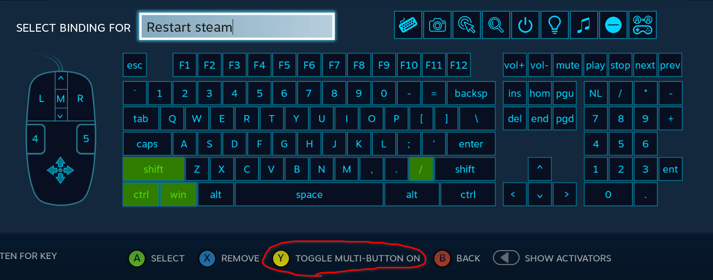

# Linux Steam hacks
Collection of hacks to make gaming on Linux via Steam a bit nicer.

## restart-steam.sh
When casting to a TV in another room via Steam Remote Play, unfortunately there is [a bug](https://github.com/ValveSoftware/steam-for-linux/issues/6749) where the audio becomes corrupted after a couple of hours of play.

Rebooting Steam fixes it, but that requires getting off the sofa and doing it from the host, this allows you to do it remotely.

**How to install it:** Bind a keyboard shortcut that you're not going to use for anything else (e.g. `ctrl`+`shift`+`win`+`/`) to this script in your desktop environment (easy to do in KDE). Then, in the Steam "Steam Button Chord Configuration" screen, configure a shortcut on the controller to invoke this keyboard shortcut, see example:

I have bound `Guide`+`X` and can press this remotely to restart Steam. Getting up from the sofa: avoided!

## kill-uplay.sh

UPlay or whatever they're calling it now is a poorly implemented piece of junk that nobody asked for. After finishing a game it doesn't even close itself down properly and doesn't respond properly to a controller over Remote Play either. This script closes it after your game closes.

_NOTE:_ don't use this if you actually rely on any UPlay features like cloud syncing.

_NOTE:_ currently it's hardcoded to Assasin's Creed Odyssey - figure out a neater way or change the script as appropriate to whatever you're playing right now.

